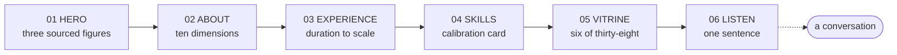
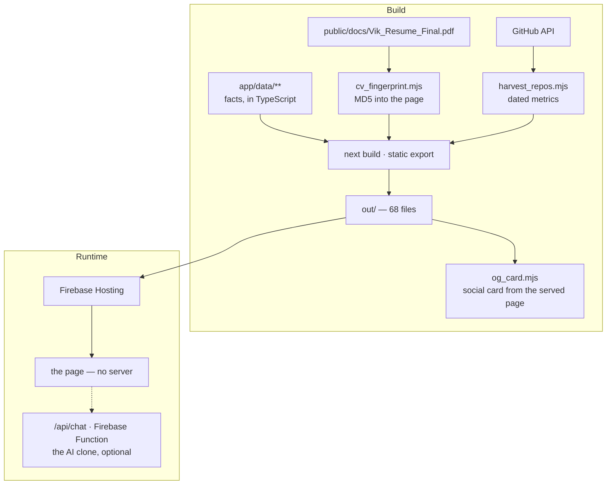

<div align="center">

```
        ┌─────────────────────────────────────────────────────────┐
        │                                                         │
        │   ⌐               V I K R A M                       ¬   │
        │                 D E S H P A N D E                       │
        │   └        delivery leadership · ai solutions        ┘   │
        │                                                         │
        └─────────────────────────────────────────────────────────┘
```

# Forgotten Mistory

**A portfolio that asks to be checked.**

[](https://forgotten-mistory.web.app)
[](https://nextjs.org)
[](scripts/validate/overhaul_static_audit.mjs)
[](scripts/validate/axe_live_audit.mjs)

*"I have been wrong often enough to want to hear it early."*

```
╔══════════════════════════════════════════════════════════════════╗
║  SIX SECTIONS · ZERO PROFICIENCY BARS · EVERY FIGURE SOURCED     ║
║  static export · no analytics · no trackers · no cookies         ║
╚══════════════════════════════════════════════════════════════════╝
```

</div>

---

## ◆ Table of contents

- [What this is](#-what-this-is)
- [The argument](#-the-argument)
- [The six sections](#-the-six-sections)
- [The caliper bracket](#-the-caliper-bracket)
- [Design system](#-design-system)
- [Architecture](#-architecture)
- [Content model](#-content-model)
- [Synthetic media, and where it is declared](#-synthetic-media-and-where-it-is-declared)
- [Repository layout](#-repository-layout)
- [Getting started](#-getting-started)
- [Quality gates](#-quality-gates)
- [Deployment](#-deployment)
- [Known limitations](#-known-limitations)

---

## ◆ What this is

The portfolio of **Vikram Deshpande** — Scrum Master and Project Manager on the Australian
Taxation Office's Payday Super program, and an AI solutions architect — written for three
readers: hiring executives, recruitment agents, and prospective business clients.

It is a Next.js 14 static export on Firebase Hosting. There is no server at request time,
no analytics, no tracker and no contact form.

---

## ◆ The argument

Every portfolio claims competence. This one is built so a reader can **check** the claims
without leaving the page, and so it says plainly when a claim cannot be checked.
| Principle | How it is enforced |
| --- | --- |
| Every figure carries its source | The source is printed under the figure, not in a tooltip |
| No self-assigned scores | `tests/e2e/about.spec.ts` fails the build if a rating appears |
| No proficiency bars | `tests/e2e/skills.spec.ts` fails on any bar, meter or star |
| Unmeasurable is stated, not omitted | The open caliper, with the reason where the value would be |
| Content matches the CV | The Skills footer prints an MD5 of the PDF, generated from its bytes |
| Repository metrics are dated | Harvested from the GitHub API on a stated date, never implied live |
| The synthetic thing says it is synthetic | One production credit in the footer names the assistant's generated likeness and cloned voice |

---

## ◆ The six sections
| # | Section | What it does | Its signature |
| --- | --- | --- | --- |
| 01 | **Hero** | Name, one sentence, three figures, two actions | Server-rendered — complete with JavaScript disabled |
| 02 | **About** | The ten dimensions his own job-fit engine scores a candidate on, answered | A ten-spoke compass that points, and refuses to score |
| 03 | **Experience** | Sixteen years on one time axis | Bar length **is** duration — nothing else is encoded |
| 04 | **Skills** | A calibration card: capability, evidence, where, status | The row that says a certificate is *not yet held* |
| 05 | **What is keeping me busy** | Six of thirty-eight repositories | A bespoke mechanism drawing per repo, and a named-exclusions block |
| 06 | **Always willing to listen** | The closing screen | The emptiest screen on the site, after the densest |



---

## ◆ The caliper bracket

One mark, three states, and the only thing the site asks a reader to learn.
| State | Drawing | Meaning |
| --- | --- | --- |
| **Closed, gold** | Solid hairline jaws | Measured, and its source is printed with it |
| **Closed, grey** | Solid jaws, grey value, `◐` | Self-reported: a CV figure with no published methodology |
| **Open** | Dashed jaws that do not meet, over a hatch | Measured and found honestly **unmeasurable** — the reason stands where the value would be |

The open bracket is a *positive mark*, not a hole. That distinction is the whole device: it
separates *"I could not honestly measure this"* from *"I forgot to fill this in."*

Gold appears **only** on marks of verified evidence. The static audit permits the accent in
`app/globals.css` and `lib/palette.ts` and nowhere else — a component writing the hex
directly fails the build.

---

## ◆ Design system
| Role | Face | Where it is allowed |
| --- | --- | --- |
| Display | **Source Serif 4** (400) | The h1, six section titles, every large figure |
| Body | **Inter** (400/500/600) | Everything read at length |
| Data | **IBM Plex Mono** (400/500) | Sources, dates, axis readouts, repository metrics |

Italic appears **exactly once** on the entire site — the closing sentence — and a test
asserts it.

Colour is achromatic plus one accent, taken verbatim from the Aether brand tokens so the
product and the portfolio read as the same hand:
| Token | Value |
| --- | --- |
| `--ink-900` … `--ink-700` | `#0A0B0D` · `#121317` · `#1B1D23` |
| `--mist-400` · `--mist-200` · `--white` | `#8A8F9A` · `#C9CDD6` · `#F4F6FA` |
| `--gold` · `--gold-light` · `--gold-pale` | `#c9a84c` · `#d4b65c` · `#e8d5a3` |

---

## ◆ Architecture



**WebGL policy.** At most one context per section, mounted only while its slot is within
half a viewport and torn down when it leaves. Nothing mounts on a software renderer or
under `prefers-reduced-motion`, and **every section is complete without it** — the About
compass, which used to be a scene, is now inline SVG for exactly that reason.

---

## ◆ Content model

Facts live in typed modules and nowhere else. A section renders them; it never restates
them.
| File | Purpose |
| --- | --- |
| `app/data/siteContent.ts` | Roles, dates, skills, contact — parity with the CV PDF |
| `app/data/portfolio/hero.ts` | The front door: one sentence, three figures with sources |
| `app/data/portfolio/about.ts` | The ten fit dimensions, verbatim from the engine that emits them |
| `app/data/portfolio/experience.ts` | Month-precision spans; a role without one fails the build |
| `app/data/portfolio/skills.ts` | Capabilities, evidence, and where each was measured |
| `app/data/portfolio/vitrine.ts` | The six repositories, and the three excluded with reasons |
| `app/data/portfolio/listen.ts` | Sixty-six words |
| `app/data/generated/*` | Written by build scripts — CV fingerprint, repo harvest |

---

## ◆ Synthetic media, and where it is declared

The site used to end with a twenty-nine-second clip of a synthetic Vikram introducing himself.
It was removed: a self-introduction is the one thing a page arguing *check my claims* cannot
ask you to take on trust, and four sentences of "what you're watching is an AI-generated
avatar" is a disclaimer, not a demonstration. The player, its stylesheet, its data module and
4,078,491 bytes of assets went with it, and the asset URL returns 404.

What remains synthetic is the assistant. Its launcher plays a model-generated likeness built
from his own photograph, and on first open it greets you in his own cloned voice.

That is declared exactly once, in the footer, as a line of authorship — the way a film names
its cinematographer:

> The assistant's face is a model-generated likeness built from my own photograph, and its
> greeting is my own voice, cloned. Everything else here — every figure, every drawing, every
> line — is not.

No modal, no banner, no badge, no asterisk, no warning icon, and nothing pre-emptive beside it.
Removing an apology never removes the accuracy it happened to carry.

---

## ◆ Repository layout

```
app/
  page.tsx                 74 lines — a composition, nothing else
  layout.tsx               Fonts, metadata, JSON-LD
  globals.css              Tokens, and the styles the six sections do not own
  data/                    The facts (see Content model)
components/
  sections/                One folder per section: markup, styles, data, scene
    Hero/  About/  Experience/  Skills/  Vitrine/  Listen/
  marks/Caliper.tsx        The one mark the site asks a reader to learn
  gl/                      Scene + capability probe — the only place a Canvas may exist
  site/Navigation.tsx      Menu; every anchor must resolve to a real section
  site/Footer.tsx          The statement, the production credit, and a build stamp read
                           from git at build time — the short SHA links to the commit
                           that produced the bytes you are reading
  MiniVicBot.tsx           The AI clone (optional Firebase Function behind it)
scripts/
  build/cv_fingerprint.mjs Stamps the CV's MD5 into the calibration card
  build/harvest_repos.mjs  Dated repository metrics from the GitHub API
  build/og_card.mjs        Renders the social card from the served page
  validate/                The audit gates
  validate/lib/            Shared guards — including the readiness probe that asserts
                           WHICH service answered, after six phase gates spent months
                           passing against an unrelated API that happened to hold :8000
tests/
  e2e/                     One spec per section — the contracts above
```

---

## ◆ Getting started

```bash
npm ci
npm run dev                     # http://localhost:8080

npm run build:static            # → out/  (also stamps the CV fingerprint)
python3 -m http.server 5599 --directory out
PLAYWRIGHT_BASE_URL=http://localhost:5599 npx playwright test tests/e2e
```

> Playwright launches the **system Chrome** (`channel: 'chrome'`). The config's default
> base URL is port 8080, so pass `PLAYWRIGHT_BASE_URL` when testing the static export.

---

## ◆ Quality gates
| Gate | Command | Bar |
| --- | --- | --- |
| Types | `npx tsc --noEmit` | clean |
| Lint | `npx next lint` | clean |
| Static audit | `node scripts/validate/overhaul_static_audit.mjs` | 10/10 |
| Section suites | `npx playwright test tests/e2e` | all green |
| Accessibility | `node scripts/validate/axe_live_audit.mjs` | 0 serious/critical |

The static audit enforces: achromatic-plus-one-accent, the three-face type system, asset
budgets (image ≤ 0.5 MB · video ≤ 2.5 MB · audio ≤ 1 MB), CV parity, no client secrets, no
placeholder markers, and design-token agreement.

---

## ◆ Deployment

```bash
git fetch origin && git log --oneline HEAD..origin/main   # must be empty
git push origin HEAD:main
node scripts/deploy.mjs                                   # builds HEAD in a detached worktree, deploys, verifies the live commit
```

`scripts/deploy.mjs` refuses to ship a commit that is not on `origin/main`, builds from a
detached worktree at `HEAD` (so uncommitted edits cannot reach production), deploys with
`firebase.json` (rewrites for `/api/chat` and `/api/tts`, the security headers) and then
reads the `build-commit` meta tag back from the live page. Never deploy with
`firebase.static.json` — it replaces the rewrites with a catch-all to `index.html`.

The delivery cadence is continuous: every verified increment lands on `main` and is
deployed within about ten minutes; no single agent workflow runs longer than thirty.

---

## ◆ Delivery log

| When (UTC) | Commit | What changed | Verified by |
| --- | --- | --- | --- |
| 2026-09-05 00:0x | cycle 1 | Toolchain back to green: dead components with missing imports removed, `functions/index.js` chat handler repaired, Playwright limited to `*.spec.ts` (276 tests discovered), 4K masters moved out of `public/`, MiniVic idle loop re-encoded to 1.1 MB 720p, 43 orphaned CSS rules removed | tsc · lint · static audit 10/10 · node --test 68/68 · smoke suite · live `build-commit` meta |

---

## ◆ Known limitations

Stated here for the same reason the site states its own: a reader should not have to
discover them.

- **`/api/tts` returns 502.** `ELEVENLABS_API_KEY` in the environment file holds a key *ID*
  rather than a key (they begin `sk_`). The AI clone's text path (`/api/chat`) works; its
  speech path does not until the key is replaced.
- **`DI_D_API_KEY` returns 403.** The D-ID pipeline described in `services/` is not
  reachable with the current credential.
- Repository metrics are **harvested and dated**, not live — a static export cannot query
  an API at request time, and the page says so rather than implying otherwise.
- The WebGL scenes do not mount on software renderers by design, so a headless browser
  sees the fallback. That is correct behaviour, not a missing feature.

---

<div align="center">

```
╔══════════════════════════════════════════════════════════════════╗
║                                                                  ║
║   Some of the brackets on this site are deliberately left open.  ║
║   That was a choice, and it is the point.                        ║
║                                                                  ║
╚══════════════════════════════════════════════════════════════════╝
```

*Built in Melbourne. Every claim on the page has somewhere you can go and check it.*

</div>
