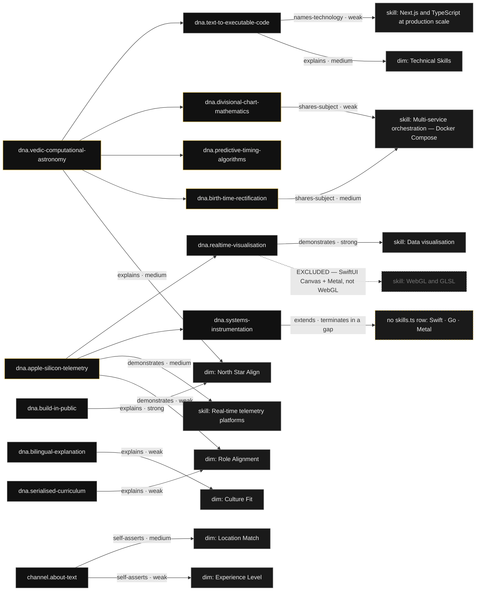

# Channel Content Analysis — `@vicd0ct`

**Dataset:** `channel-analysis` · schema 1.0.0
**Contract:** R-8, R-108, R-113, R-114, R-115, R-117, R-118, R-119, R-120, R-121, R-122, R-143, R-182 · Gate M · T-26
**Machine-readable form of record:** [`channel-analysis.json`](./channel-analysis.json) — this document is a reading of that file and adds no claim absent from it.

---

## 0 · Generation record (R-143)

| Field | Value |
|---|---|
| Producer | Claude Code subagent · execution step 8 |
| Model id | `claude-opus-5[1m]` |
| Method | Deterministic re-read of the collected corpus. **No new network call to YouTube was made by this step.** Every count, sum, median and feature list below was recomputed with `python3` from `corpus-youtube.json` and is reproducible from that file alone. |
| Input dataset | `corpus-youtube.json` · 69,439 bytes · generated `2026-09-03T20:08:39Z` · sha256 recorded in the JSON |
| Join targets | `app/data/portfolio/about.ts` (`aboutContent.dimensions[].name`) · `app/data/portfolio/skills.ts` (`capabilities[].capability`) |
| Cost | *not observable* — no metered API was called |
| Fabrication policy | Zero. Every field carries its source. Anything absent from the input corpus is the literal string `not observable` with the reason. |

---

## 1 · The evidence ceiling — read this before using anything below

The corpus reports the channel as **reachable and not empty**: 10 public videos plus 1 unlisted video exposed by a public playlist, 11 records in total, all with titles, publish dates, durations and **full verbatim descriptions**.

It also reports, for all 11 records:

- `transcript.value` = **`not observable`**
- `captions_available.value` = **`not observable`**

Every watch request returned `playabilityStatus=LOGIN_REQUIRED`, confirmed from real headless Chrome as well as `curl` (`generation_record.methods_used_in_preference_order[3]`).

**Therefore this is an analysis of written production artefacts and corpus structure, not of spoken content.** Three consequences bind the site:

1. **R-122 is blocked on evidence, not implementation.** No transcript index, no timestamp deep-linking corpus can be built. The only timestamped index that exists anywhere in this corpus is the seven-chapter list the creator wrote himself into `p9pGAmqJCSk`'s description.
2. **R-120 framing must come from description text, series architecture and cadence.** Any on-site sentence of the form *"In the video he says…"* would be fabrication.
3. **R-119 is observed strictly.** View counts *were* retrievable and are deliberately excluded from every cluster, ranking and depth signal here. Cluster membership is by subject, never by reach.

---

## 2 · Subject taxonomy and theme clusters

Clusters were assigned from literal named entities in each record's verbatim title and description. A record joins a cluster only where the cluster's entities appear literally in that record's text.

### Cluster 1 — Vedic computational astronomy as executable code
**9 of 11 records · 3,928 s (1:05:28)**
`Q1NwbcHbAh0` `oiTfTeqvP0Y` `_L-jRltlZI4` `c_M_LSB65RA` `6RT2caAAYfs` `Q5yGe7uBkFA` `TDOubaCAw7I` `9meaN-ZZAvc` `gMe4FZbjcQE`

Defining entities, each observed literally:

| Entity | In records |
|---|---|
| Brihat Parashara Hora Shastra / BPHS / बृहत पराशर होरा शास्त्र | `Q1NwbcHbAh0` `_L-jRltlZI4` `c_M_LSB65RA` `gMe4FZbjcQE` `9meaN-ZZAvc` `OEn5RzSEwpc` |
| Vargas / Divisional Charts | `Q1NwbcHbAh0` `gMe4FZbjcQE` `9meaN-ZZAvc` |
| Vimshottari Dasha | `TDOubaCAw7I` |
| Python | `Q1NwbcHbAh0` `TDOubaCAw7I` `gMe4FZbjcQE` `9meaN-ZZAvc` `c_M_LSB65RA` |
| Next.js | `TDOubaCAw7I` `gMe4FZbjcQE` `9meaN-ZZAvc` |
| If/Else logic applied to Sanskrit shlokas | `gMe4FZbjcQE` `9meaN-ZZAvc` `c_M_LSB65RA` |

The cluster states its own thesis, verbatim, in `gMe4FZbjcQE`:

> Stop looking at it as magic—start looking at it as data science.

### Cluster 2 — Birth-time rectification as a deterministic procedure
**2 records** · `OEn5RzSEwpc` `c_M_LSB65RA`

A proper subset of Cluster 1 by subject, promoted because it is **the one subject with a matching named repository** — `containerised-birth-time-rectifier`, which is `sources[].id = 'rectifier'` in `skills.ts`. Entities: *Ishtakala Method*, *Birth Time Rectification (BTR)*, *Prashna Lagna*, *Nisheka*, *Samvatsar / Ritu / Masa / Nakshatra*, and — in Marathi — chart correction framed literally as `कुंडलीचे 'डीबगिंग' (Debugging)`.

### Cluster 3 — Real-time Apple Silicon telemetry, rendered as a cinematic HUD
**1 record · 121 s** · `p9pGAmqJCSk`

Named stack: *Swift 5 + SwiftUI, Go 1.21+, Metal, IOKit + SMC + IOReport*. Named quantities: *700 vector paths, 12 concentric rings, 60 frames per second*, *Go telemetry daemon streams JSON at 1Hz*. It is the only 2026 record and **shares no named entity with any other record in the corpus**.

### Series architecture

| Series | Records | How it is evidenced |
|---|---|---|
| प्राचीन अल्गोरिदम (Marathi, 3 numbered parts) | `_L-jRltlZI4` → `c_M_LSB65RA` → `6RT2caAAYfs` | Titles carry (भाग १/२/३); every description ends with a `संपूर्ण सिरीज पहा` block linking the other two and marking itself `हा व्हिडिओ`. Playlist `PLrQIbUti-A-EUHHEUZIsVj7BQoWZrUTbV`, listed as **playlist + podcast**. |
| English "Part 1 / Part 2" | `TDOubaCAw7I` → `gMe4FZbjcQE` | Literal `Part 1: ` / `Part 2: ` title prefixes. No in-description cross-link block, unlike the Marathi series. |
| Playlist "The Math of the Stars" | `9meaN-ZZAvc` `TDOubaCAw7I` `Q5yGe7uBkFA` `Q1NwbcHbAh0` | `yt-dlp --flat-playlist`. **Publication hazard:** this public playlist exposes the unlisted `9meaN-ZZAvc`. |

### Language

4 Marathi (Devanagari titles), 7 English. **The same syllabus is delivered twice inside one week** — the Marathi three-parter on 20 Nov and the English opener-plus-pair across 19–25 Nov both walk BPHS → Sanskrit-as-code → divisional charts.

---

## 3 · Format and structure patterns

Regex feature detection over all 11 verbatim descriptions. Hit lists are exhaustive, not sampled.

| Pattern | Hits | Records | Exception |
|---|---|---|---|
| A question in the description | **10 / 11** | all except `Q5yGe7uBkFA` | `Q5yGe7uBkFA` is the only record with no question mark anywhere |
| Labelled contents block | **10 / 11** | `FEATURES SHOWN IN THIS VIDEO`, `**IN THIS VIDEO**`, `What's Inside:`, `Topics:`, `Topics Covered:`, `या व्हिडिओमध्ये:`, `महत्वाचे मुद्दे:` | `Q5yGe7uBkFA` (89-char description, no structure) |
| Named technology stack | 6 / 11 | `p9pGAmqJCSk` `gMe4FZbjcQE` `TDOubaCAw7I` `c_M_LSB65RA` `Q1NwbcHbAh0` `9meaN-ZZAvc` | |
| Funding link (`ko-fi.com/vicscoding`) | 5 / 11 | `OEn5RzSEwpc` `gMe4FZbjcQE` `TDOubaCAw7I` `Q1NwbcHbAh0` `9meaN-ZZAvc` | all 2025 |
| Repository link (`github.com/VictordTesla24`) | 4 / 11 | `gMe4FZbjcQE` `TDOubaCAw7I` `Q1NwbcHbAh0` `9meaN-ZZAvc` | all 2025 |
| In-description series navigation | 3 / 11 | the Marathi trio only | |
| Explicit subscribe / CTA block | 2 / 11 | `p9pGAmqJCSk` `OEn5RzSEwpc` | |
| Timestamped chapter index | **1 / 11** | `p9pGAmqJCSk` (7 chapters across 121 s) | |

**The canonical skeleton**, conformed to by 9 of 11 records: a question → one or two paragraphs stating claim and method → funding and/or repository link → a labelled block of 3–8 single-line promises → an optional closing reframe or series navigation. Non-conforming: `Q5yGe7uBkFA`, `oiTfTeqvP0Y`.

**Format classes:** 8 long-form explainers (6–11 min) · 1 short explainer (3 min) · 1 chaptered product demo (2 min) · 1 promotional micro-record (44 s).
**Shorts: 0. Live streams: 0.** The channel has no Shorts and no Streams tab at all — `Q5yGe7uBkFA` is 44 s but is a regular upload.

---

## 4 · Cadence and consistency

> **Precision caveat:** YouTube served **day precision only**. No ISO timestamp was available on the bot-gated watch pages, so the four records sharing 20 Nov 2025 have no observable intra-day order.

| Date | Records | Ids |
|---|---|---|
| 2025-11-19 | 2 | `Q1NwbcHbAh0` `oiTfTeqvP0Y` |
| 2025-11-20 | 4 | `_L-jRltlZI4` `c_M_LSB65RA` `6RT2caAAYfs` `Q5yGe7uBkFA` |
| 2025-11-22 | 2 | `TDOubaCAw7I` · `9meaN-ZZAvc` *(unlisted)* |
| 2025-11-25 | 1 | `gMe4FZbjcQE` |
| 2025-11-27 | 1 | `OEn5RzSEwpc` |
| **— 140-day silence —** | 0 | |
| 2026-04-16 | 1 | `p9pGAmqJCSk` |

- **Burst:** 10 of 11 records (91%) inside an **8-day window**, 19–27 Nov 2025.
- **Silence:** **140 days**, 27 Nov 2025 → 16 Apr 2026, computed from the two `dateText` values.
- **Account age:** the channel joined **28 May 2015** — roughly ten and a half years before its first observed upload.

**Verdict: this is not a cadence. It is one concentrated campaign, then a gap, then one unrelated release.** Enumeration was exhaustive (yt-dlp against `/videos`, `/podcasts`, `/playlists`, cross-checked against `ytInitialData`) and the channel's own About page claims "10 videos", matching the 10 public records found — so the gap is real, not a collection artefact.

**R-120 framing guidance:** present the burst as a campaign *with a shape* — one thesis, two languages, three formats, eight days — and the 2026 record as a separate later artefact. Do not present the channel as a regular publishing habit; the dates do not support it.

---

## 5 · Depth signals

**Runtime.** Total 4,239 s (**1:10:39**) across 11 records; 3,636 s (**1:00:36**) across the 10 public ones. Shortest 44 s (`Q5yGe7uBkFA`), longest 605 s (`gMe4FZbjcQE`), **median 433 s** (`Q1NwbcHbAh0`). Eight records exceed six minutes.

**Technical density** — distinct domain entities named literally in the description:

| Record | Count | Sample |
|---|---|---|
| `p9pGAmqJCSk` | 14 | Swift 5, SwiftUI, Go 1.21+, Metal, IOKit, SMC, IOReport, P-Core, E-Core, Neural Engine, DRAM bandwidth, 1Hz JSON — the only record publishing an implementation spec sheet rather than a topic list |
| `OEn5RzSEwpc` | 8 | BPHS, Ishtakala, BTR, Prashna Lagna, Nisheka, Samvatsar, Ritu, Masa/Nakshatra — **highest density per second: 8 entities in 190 s** |
| `gMe4FZbjcQE` | 7 | BPHS, Vargas, Maharishi Parashara, Maitreya, Sanskrit Shlokas, If/Else, "Python, Next.js, AI, Vedic Math" |
| `Q5yGe7uBkFA` | 1 | "Sanskrit verses" |

**Teaches or demonstrates**, classified from the verb the creator uses about himself:

- **Teaches — 9 records.** *"I translate the Brihat Parashara Hora Shastra (BPHS)—a 7,000-year-old Vedic text—into executable Python code"* (`gMe4FZbjcQE`) · *"I break down how precise astronomical calculations were performed thousands of years ago without computers"* (`Q1NwbcHbAh0`) · *"we decode the Brihat Parashara Hora Shastra (BPHS)"* (`OEn5RzSEwpc`) · *"We explore how this predictive logic works and whether it can be digitized"* (`TDOubaCAw7I`).
- **Demonstrates — 1 record.** `p9pGAmqJCSk`: `FEATURES SHOWN IN THIS VIDEO` and seven timestamped chapters from boot to shutdown. It shows a working artefact end to end; it does not claim to teach how it was built.
- **Promotes only — 1 record.** `Q5yGe7uBkFA`.

**Verdict:** long, dense, method-committed teaching records, plus one short chaptered demonstration. The corpus reads as one person explaining a hard idea repeatedly at length, and one person shipping a thing and showing it working.

**Not measurable:** spoken pacing and jargon load (no transcript) · on-screen code or diagrams (no frame inspected) · audience comprehension (no comment data).

---

## 6 · Production evolution

| Date | Record | Description chars |
|---|---|---|
| 2025-11-19 | `Q1NwbcHbAh0` | 766 |
| 2025-11-19 | `oiTfTeqvP0Y` | 243 |
| 2025-11-20 | `_L-jRltlZI4` | 863 |
| 2025-11-20 | `c_M_LSB65RA` | 908 |
| 2025-11-20 | `6RT2caAAYfs` | 835 |
| 2025-11-20 | `Q5yGe7uBkFA` | 89 |
| 2025-11-22 | `TDOubaCAw7I` | 506 |
| 2025-11-22 | `9meaN-ZZAvc` *(unlisted)* | 905 |
| 2025-11-25 | `gMe4FZbjcQE` | 905 |
| 2025-11-27 | `OEn5RzSEwpc` | 1,317 |
| 2026-04-16 | `p9pGAmqJCSk` | **1,781** |

**Phase 1 — Opening, two languages, no template (19 Nov).** Both subjects launch the same day: the English record already carries the full skeleton (766 chars, contents block, repo + funding links); the Marathi one is 243 chars of prose.

**Phase 2 — The Marathi series; the template arrives, and so does navigation (20 Nov).** Three records the same day, 835–908 chars each, numbered titles, emoji-bulleted contents blocks, and a three-way `संपूर्ण सिरीज पहा` navigation block. This is the **only** appearance of inter-episode navigation in the corpus. `Q5yGe7uBkFA` ships the same day at 89 chars — the one production artefact that received no craft.

**Phase 3 — English long-form, and a visible re-cut (22–25 Nov).** `9meaN-ZZAvc` (unlisted, 603 s, 22 Nov) and `gMe4FZbjcQE` (public, 605 s, 25 Nov) carry **byte-identical 905-character descriptions**, with titles differing only by the `Part 2: ` prefix. The 22 Nov cut was withdrawn from listing and republished three days later as an explicitly numbered part of a series. **This is the only direct evidence in the corpus of the creator revising a shipped artefact.**

**Phase 4 — Peak explanatory density (27 Nov).** 1,317 chars, eight named entities in a 190-second record, and the corpus's most compressed analogy: *"Much like Sherlock Holmes tracing a suspect, we move from circumstantial evidence to scientific calculation."* Format tightens while density rises.

**Phase 5 — 140-day break, then a different kind of artefact (16 Apr 2026).** 1,781 chars, the longest in the corpus. First and only timestamped chapter index. First and only implementation spec sheet. Funding and repository links dropped; a subscribe/like/comment CTA appears instead. The subject moves from explaining someone else's system to demonstrating his own.

**Trajectory:** description craft rises monotonically on every observable measure — length 243 → 1,781 chars, structure prose → contents block → navigation block → timestamped chapters, specificity topic promises → named-entity lists → a full implementation spec. The one thing that does *not* persist is the funding and repository links.

**Not measurable:** video, audio, editing, thumbnail or motion-graphics quality over time — no media asset was ever downloaded or inspected.

---

## 7 · Communication evidence — what the corpus actually proves

**Scope:** evidence of how he *constructs* an explanation in writing and *architects* a syllabus. Not evidence of spoken delivery.

**Proven.**

1. **Analogy from the audience's own domain, before any term from his** — 5 instances: *"a 'cosmic zoom lens'"* (`gMe4FZbjcQE`), *"functions like a 'Cosmic Operating System'"* (`Q1NwbcHbAh0`), *"Much like Sherlock Holmes tracing a suspect"* (`OEn5RzSEwpc`), *"आम्ही फक्त त्याचे 'कंपायलर' (Compiler) बनवले आहे"* (`6RT2caAAYfs`), *"What if your Mac had an Iron Man-style interface?"* (`p9pGAmqJCSk`).
2. **Cross-domain translation at the level of mechanism, not vibe** — *"Sanskrit Shlokas function like modern Computer Algorithms (If/Else logic)"* (`gMe4FZbjcQE`) · *"संस्कृत = कोड: प्राचीन श्लोक आणि मॉडर्न पायथन फंक्शन (Python Functions) यांची तुलना"* and *"कुंडलीचे 'डीबगिंग' (Debugging) कसे चालते?"* (`c_M_LSB65RA`) · *"Translating the sun's longitude into Python"* (`Q1NwbcHbAh0`).
3. **He names the audience inside the artefact** — *"The 'Cosmic Zoom Lens' (Vargas) explained for developers"* (`gMe4FZbjcQE`) · *"If you love history, coding, or astronomy, this video is for you"* (`Q1NwbcHbAh0`).
4. **Decomposition into numbered parts with a promise per part and explicit navigation** — the Marathi trio cross-links all three ways; the English pair is numbered in title only.
5. **A contract before the content** — a question in 10 of 11 descriptions, a labelled contents block in 10 of 11, both in 9 of 11.
6. **Bilingual delivery that re-frames rather than translates** — the Marathi records add a heritage argument (*"🌍 विश्वगुरू: हे ज्ञान केवळ भारताचे नसून संपूर्ण मानवजातीचा वारसा का आहे?"*, `6RT2caAAYfs`) that no English record contains.
7. **He states the reframe he wants you to leave with, as an instruction** — *"Stop looking at it as magic—start looking at it as data science."*
8. **Where the artefact is a demonstration, the topic list becomes a timestamped route** — `p9pGAmqJCSk`'s seven chapters.
9. **He publishes the source beside the claim** — the repository link in 4 records.

**Not proven — and must never be asserted on the site.**

| Claim | Why not |
|---|---|
| Spoken clarity, pacing, accent, filler rate, ability to hold a listener | 0 of 11 records yielded transcript or caption text; `LOGIN_REQUIRED` confirmed from real Chrome |
| Whether code shown on screen runs, or matches the linked repository | No frame inspected; no video↔repository correspondence verified |
| Whether viewers understood | No comment, retention or engagement data in the corpus — and R-119 would bar leading with it regardless |
| Live or unscripted explanation ability | `counts.live_streams = 0`; no streams tab exists |

**Verdict for site use.** The corpus supports sentences like: *"He explains a hard idea by first handing you an analogy from your own field, then stating the mechanism, then showing you the source."* It supports no sentence beginning *"In the video he says…"*.

---

## 8 · Cross-section weave (R-121)

**Join keys.** About → `aboutContent.dimensions[].name` (verbatim from the aether product; never paraphrase). Skills → `capabilities[].capability` (verbatim string). **`skills.ts` capabilities carry no stable `id` field**, so the string is the only key available; the array index is recorded alongside as a redundancy for the day the file is refactored.

### About Me — 6 of 10 dimensions supported

| Dimension | Support | Records | Reading |
|---|---|---|---|
| **Technical Skills** (0) | corroborating | `p9pGAmqJCSk` `gMe4FZbjcQE` `TDOubaCAw7I` `Q1NwbcHbAh0` `9meaN-ZZAvc` `c_M_LSB65RA` | Five records name Python, three name Next.js. **Caveat:** the 2026 record names Swift 5, Go 1.21+, Metal and IOKit — none of which `about.ts` or `skills.ts` currently claims. |
| **Experience Level** (1) | self-asserted only | — | Channel About says *"Senior Technical Program Manager AI Solution Architect"*. The owner's own words on his own channel; no dates, no employer. |
| **Industry Match** (2) | *not observable* | — | No record or channel field mentions government, banking or telecommunications. |
| **Role Alignment** (3) | weak, thematic | `p9pGAmqJCSk` | Consistent with the "who architects" half. Nothing speaks to the delivery-leadership half. **Keep out of headline position.** |
| **Culture Fit** (4) | adjacent | the 4 Marathi + 2 English | Same material rebuilt for two audiences in one week, re-framed per audience. **Caveat:** evidences cross-audience explanation, not squad facilitation. |
| **Salary Fit** (5) | *not observable* | — | Role-side dimension. |
| **Location Match** (6) | corroborating | — | Channel About: *"here in Melbourne"*, *"🇦🇺 Naarm"*; `channel.country` = Australia. |
| **Career Growth** (7) | *not observable* | — | No record mentions evaluation, guardrails, error budgets or assurance. "AI" appears once, as a bare word in a stack list. |
| **Company Stability** (8) | *not observable* | — | Role-side dimension. |
| **North Star Align** (9) | **corroborating — strongest edge** | `gMe4FZbjcQE` `TDOubaCAw7I` `Q1NwbcHbAh0` `9meaN-ZZAvc` | Four records publish the source repository beside the claim, and the campaign's stated thesis is an instruction to treat the subject as checkable data rather than belief. |

### Skills — 4 of 17 capability rows supported

| Capability | Support | Records | Caveat |
|---|---|---|---|
| **Data visualisation** (12) | corroborating | `p9pGAmqJCSk` | *"700 vector paths, 12 concentric rings, and 60 frames per second of pure real-time data visualization"* — a third named artefact for a row currently evidenced by two repositories. |
| **Real-time telemetry platforms** (2) | same class, different artefact | `p9pGAmqJCSk` | Go daemon → 1 Hz JSON → 60 fps renderer over per-core CPU, GPU, Neural Engine, DRAM, network, thermal. **Must not imply corroboration of the ANZ 10,000-device / P95 figure.** |
| **Multi-service orchestration — Docker Compose** (10) | shares subject with the row's repository | `OEn5RzSEwpc` `c_M_LSB65RA` `gMe4FZbjcQE` `9meaN-ZZAvc` | Via `sources[].id='rectifier'`. The channel is the public explanation of that repository's problem domain. **It evidences the domain, not the orchestration — no record mentions Docker, Compose or containers.** |
| **Next.js and TypeScript at production scale** (7) | names the technology, different project | `TDOubaCAw7I` `gMe4FZbjcQE` `9meaN-ZZAvc` | **TypeScript is never named in any description.** Additional project using Next.js, not corroboration of the aether counts. |
| **WebGL and GLSL — three.js, R3F** (11) | **deliberate non-edge** | `p9pGAmqJCSk` | Superficially the closest record — real-time vector rendering, shaders, 60 fps — but its named stack is **SwiftUI Canvas + Metal**: different API, different platform. Drawing this edge would be fabrication by association. |

The remaining twelve rows — mainframe test automation, agile delivery at scale, cloud-native migration, programme/portfolio, multi-agent systems, LLM eval & guardrails, Node.js/Express, containerised delivery, CSM, MSc, BE, AWS/GCP — are **`not observable`** in this corpus, each with its reason recorded in the JSON.

**Coverage reading.** The channel strand is **not** a general corroborator of the CV. It supports 4 of 17 capability rows and 6 of 10 dimensions, and it contributes two languages (Swift, Go) and one graphics API (Metal) that no other dataset carries. Its real weight lands on **North Star Align** and on an explanatory capacity that neither `about.ts` nor `skills.ts` currently has a row for.

---

## 9 · Content-DNA model (R-117)

A bipartite-plus graph: content nodes derived only from entities appearing literally in the corpus; skill and dimension nodes are the existing `skills.ts` / `about.ts` rows, addressed by verbatim join key. Every edge carries a kind, a strength, the justifying video ids, and — where it is weaker than it looks — the caveat that must travel with it into any rendering.

**Edge kinds:** `demonstrates` · `explains` · `names-technology` · `shares-subject` · `self-asserts` · `extends` · `excluded`.

### Nodes

| id | Label | Kind | Tier | Records | Weight (s) |
|---|---|---|---|---|---|
| `dna.vedic-computational-astronomy` | Vedic computational astronomy | subject | 1 | 9 | 3,928 |
| `dna.text-to-executable-code` | Ancient text → executable code | method | 2 | 5 | — |
| `dna.divisional-chart-mathematics` | Divisional charts (Vargas) as a fractal index | subject | 2 | 3 | — |
| `dna.predictive-timing-algorithms` | Vimshottari Dasha as a timing algorithm | subject | 2 | 1 | — |
| `dna.birth-time-rectification` | Birth-time rectification (Ishtakala / BTR) | subject | 2 | 2 | — |
| `dna.apple-silicon-telemetry` | Apple Silicon system telemetry | subject | 1 | 1 | 121 |
| `dna.realtime-visualisation` | Real-time data visualisation at 60 fps | method | 2 | 1 | — |
| `dna.systems-instrumentation` | Low-level sensor access (IOKit / SMC / IOReport) | method | 2 | 1 | — |
| `dna.bilingual-explanation` | Bilingual explanation (English / Marathi) | practice | 1 | 4 | — |
| `dna.serialised-curriculum` | Serialised, cross-linked curriculum | practice | 1 | 5 | — |
| `dna.build-in-public` | Publishing the repository beside the claim | practice | 1 | 4 | — |

### Edges

### Render notes (R-117 / R-109 / R-110)

- Node weight has exactly two honest encodings here: **record count** and **total runtime seconds**. Never encode weight by view count (R-119).
- Nine of eleven records sit under one tier-1 node. A force graph will collapse into one hub and one orphan. **That asymmetry is the true shape — show it, do not balance it away.**
- The `excluded` edge exists so a later renderer never infers it. Excluded edges must not be drawn, but must survive in the dataset.
- **`9meaN-ZZAvc` is Unlisted.** It contributes to node weights in this analysis but must not be rendered, linked or named on the site. Any renderer must filter `listing_status == 'Unlisted'` before drawing.

---

## 10 · Dataset extension findings (R-115)

1. **Swift 5, Go 1.21+ and Metal are evidenced by the channel and claimed nowhere else.** `p9pGAmqJCSk`. Either add rows with this evidence, or record deliberately that the site does not claim them — do not silently drop them.
2. **No `skills.ts` row covers public technical explanation, teaching or bilingual communication** — the capability this corpus evidences most strongly. A row sourced to the channel would be the natural join; under `skills.ts` semantics its status would be `production` (published publicly, for real viewers), with evidence stated as artefacts and structure, never as views.
3. **`skills.ts` capabilities have no stable id.** Every cross-link here keys on the verbatim `capability` string, with the array index recorded as redundancy. If the file is refactored, the R-117 edges must be re-keyed.
4. **R-122 is blocked on evidence.** The corpus offers no transcript, no captions and no per-second segments. The only timestamped index available anywhere is the seven chapters the creator wrote himself.

---

## 11 · `not observable` register

| Field | Reason |
|---|---|
| Transcript text (all 11) | Every watch request bot-gated `LOGIN_REQUIRED`; confirmed with real headless Chrome |
| Caption availability (all 11) | Same gate |
| ISO publish timestamps | `uploadDate`/`datePublished` meta and `playerMicroformatRenderer.publishDate` were not served; `dateText` (day precision) is all that exists |
| Channel keywords / tags | `channelMetadataRenderer.keywords` served as an empty string |
| Per-video tags, category, language metadata | No such field in the corpus; the YouTube Data API was unavailable — no `YOUTUBE_API_KEY` among the 45 variable names in `~/.claude/.env.production` (names only were listed; no value was read) |
| Comments, retention, audience data | Not collected by the corpus step |
| Thumbnail, frame or audio content | No media asset was ever downloaded or inspected |
| Like counts | `videos[].vanity_metrics_availability.like_count_available` = *not observable* |
