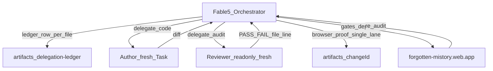

# Fable 5 Autonomous Portfolio Elevation Plan

## Locked decisions (no open options)

- **Scope:** Full §8 loop (STEPS 0–8) until SC-1..SC-10 have artifact paths, backlog is empty (or owner-deferred), then **AWAITING OWNER SIGN-OFF** — never self-declare SHIP.
- **Orchestrator writes only:** `artifacts/`, `artifacts/delegation-ledger.jsonl`, backlog, todos, correction prompts, `docs/execution-log.md` rows, final report. **Zero product code** from the orchestrator.
- **Harness mapping (Cursor):** `Task` sub-agents replace Claude Code Agent/Workflow. Role → `subagent_type` / model:
  - architect / deep implementer / VFX author / content critic → `generalPurpose` (prefer opus-class when available)
  - fast implementer / verifier (git-ancestor) → `generalPurpose` (sonnet-class)
  - mechanical → `generalPurpose` (haiku-class) or shell for renames
  - independent reviewer → `code-reviewer` or `ce-correctness-reviewer` **read-only**, fresh name per change
  - **Never** auto-dispatch `cinematic-uiux-vfx-engineer`
- **Browser lane:** Sub-agents do **not** inherit chrome-devtools MCP. Orchestrator owns the single serialized runtime lane (`npm run dev` :8080 + chrome-devtools / attached browser) for all SC-2/SC-4/SC-8 proofs. Reviewer stays file:line-only; verifier agent runs git-ancestor + artifact-presence checks; orchestrator produces screenshots/console/lighthouse/motion-delta.
- **Branch:** Stay on current `fix/telemetry-infinite-loop`; push branch + `git push origin HEAD:main` only after full gates (R8).
- **Hiring-first order:** R5 conversion defects before pure VFX polish (R4), unless a VFX defect blocks LCP/perf gates.

## Pre-seeded D-1 defects (confirm + extend in STEP 1)

These are already evidenced in source; STEP 1 must still produce browser artifacts and may add more IDs.

| ID | Defect | Primary files |
|----|--------|---------------|
| D-HERO-01 | H1 is greeting + "Vikram." only; no single CV-matching target title + location as first-paint lines (R5.1 / SC-5.1) | [app/data/siteContent.ts](app/data/siteContent.ts) `hero`, [app/page.tsx](app/page.tsx) `#hero` |
| D-HERO-02 | `hero.subtitle[1]` front-loads Vedic astronomy (C-10) | `siteContent.ts` |
| D-PROOF-01 | `#proof` / `ProofBar` sits after hero; ATF ≥3 metrics not guaranteed on 390px (R5.2) | [components/site/ProofBar.tsx](components/site/ProofBar.tsx), `page.tsx` |
| D-AVAIL-01 | No explicit open-to-work ask ATF; "currently serving" reads unavailable (R5.3) | `siteContent.ts`, hero CTA copy |
| D-CONTACT-01 | LinkedIn missing from `contact` (clone already cites `linkedin.com/in/vikramd-profile`) (R5.4) | `siteContent.ts` ~493–500, contact section in `page.tsx` |
| D-CV-01 | Sticky/always-visible "Download CV" weak; hero label is "Resume PDF" (R5.4) | [components/site/Navigation.tsx](components/site/Navigation.tsx), `page.tsx` |
| D-TRUST-01 | No scannable employer + CSM + degrees credibility band near top (R5.5) | new band from existing `experience` / certs / education in `siteContent.ts` — extend existing section, do not invent parallel data |
| D-META-01 | `<title>` / OG multi-role, not employment-first single target role (R5) | [app/layout.tsx](app/layout.tsx) |
| D-BOOT-01 | Preloader ~1.9s, no keyboard-reachable Skip (C-4 / R5.1) | [components/site/Preloader.tsx](components/site/Preloader.tsx) |
| D-CLONE-01 | MiniVic availability copy ("currently engaged" / "not on the market") fights hire framing (R5.3) | [app/data/miniVicKnowledge.ts](app/data/miniVicKnowledge.ts) |

VFX/perf: all 29 `components/fx/*` are wired; no public asset >500KB found. STEP 1 still must measure motion-delta, fps, LCP≠canvas, console err/warn on live + local.

## STEP 0 — Ground truth + lane

1. Read [docs/prompt.md](docs/prompt.md), [docs/overhaul/SPEC.md](docs/overhaul/SPEC.md), [CLAUDE.md](CLAUDE.md), `app/data/*.ts` (already partially done).
2. Create `artifacts/` + empty `artifacts/delegation-ledger.jsonl`.
3. TodoWrite from §8 STEPS 0–8.
4. Start **one** `npm run dev` (:8080). GATE: HTTP 200 + ledger exists.

`★ Insight: docs/prompt.md is the Hermes PM/Kanban SSOT; this session’s pasted Fable 5 block supersedes it for orchestration mechanics. Do not open Hermes kanban tasks unless the owner re-enables that board mid-run.`

## STEP 1 — Runtime audit (D-1)

Single browser lane against **live** `https://forgotten-mistory.web.app` and **localhost:8080`:

- Screenshots 1440 + 390 → `artifacts/D-1-audit/{desktop-1440.png,mobile-390.png}`
- `console.json` (0 err/warn gate applies to later changes; audit may record current noise)
- `lighthouse.json` + one performance trace
- Catalogue every defect with stable id (merge pre-seeded table + new findings)

GATE: D-1 folder non-empty; every defect has an id.

## STEP 2 — Hire-first backlog

Write `artifacts/backlog.json` (or `.md`) dependency-ordered:

1. D-CONTACT-01, D-HERO-01, D-AVAIL-01, D-CV-01, D-PROOF-01, D-TRUST-01, D-META-01, D-BOOT-01, D-CLONE-01, D-HERO-02
2. Then motion/VFX/perf items from audit (SC-4 / C-4a–c)

Each item: role, acceptance criteria, verification command, mapped R/SC/T-id.

GATE: every D-1 id mapped; no orphans.

## STEPS 3–5 — Per-item council cycle (repeat)

For **each** backlog item:

1. **TDD (STEP 3):** Delegate test author → commit **test-only** (extend [tests/e2e/hero.spec.ts](tests/e2e/hero.spec.ts), [tests/e2e/contact.spec.ts](tests/e2e/contact.spec.ts), [tests/content/content-check.spec.ts](tests/content/content-check.spec.ts), or audit script). GATE: failing test committed; record `testSHA`.
2. **Implement (STEP 4):** Fresh `author-<id>` Task; edit existing files only (guard-rails). Append ledger row **per file** before commit. Commit impl separately. GATE: `git merge-base --is-ancestor <testSHA> <implSHA>`.
3. **Review (STEP 5a):** Fresh `reviewer-<id>` read-only; per-criterion PASS/FAIL + file:line.
4. **Verify (STEP 5b):** Orchestrator browser proof → `artifacts/<changeId>/{desktop-1440.png,mobile-390.png,console.json,lighthouse.json}` (+ motion-delta/perf if animation). Fresh `verifier-<id>` confirms artifact presence + TDD ancestor. Hero items also run **T-3.1** blind 5s scan.

On fail → correction prompt → re-delegate (R10). Never resume author as reviewer/verifier.

### Concrete first implementation targets (after tests)

- Add `contact.linkedin`; render prominent LinkedIn in hero links + contact + nav.
- Reshape `hero` data + `#hero` markup: name, **one** target title (align with CV / dossier role), location; move personal R&D out of ATF (C-10).
- ATF availability line + reconcile ATO "Present" vs open-to-work (truthful: open while finishing ATO engagement — no simultaneous "unavailable").
- Surface ≥3 `proof` metrics in first viewport (CSS/layout or compact ATF strip — reuse `proof` data, do not duplicate numbers).
- Credibility strip from existing employers + CSM + Monash/Melbourne.
- Preloader: visible Skip (keyboard + click).
- Metadata title/OG employment-first.
- MiniVic availability answers aligned with site.

## STEP 6 — Full-gate sweep

Run and persist outputs under `artifacts/gates/`:

- `npx tsc --noEmit`
- `npm run lint`
- `node scripts/validate/overhaul_static_audit.mjs` → 8/8
- Full `npx playwright test`
- `npx playwright test tests/perf`
- `bash scripts/validate/phase02_lighthouse.sh` (note: uses `:3000` via `next start`)
- `node scripts/validate/phase04_fps_probe.mjs` (extend coverage if audit requires 390px/4× throttle)
- `npm run build:static`
- Placeholder grep + project URL curls
- Ledger vs `git diff --name-only` for each changeId

## STEP 7 — Deploy + production verify

Small one-concern commits already done per item. Then push current branch + `git push origin HEAD:main`, `firebase deploy`. Re-run live console + Lighthouse → `artifacts/prod-verify/`. Fail → fix via council → redeploy. **Ask before any paid D-ID/ElevenLabs call.**

## STEP 8 — Log + loop

Append [docs/execution-log.md](docs/execution-log.md). Re-run STEP 1. Exit only when SC checklist green + backlog closed + owner posts **SHIP**. Terminal state otherwise: **AWAITING OWNER SIGN-OFF**.

## Final report shape

- SC-1..SC-10 with ✓ + artifact path each
- Before/after hero 1440 + 390
- Live URL
- Recruiter path: `/` → Download CV / dossier ≤2 clicks
- Client path: `/` → booking CTA ≤2 clicks
- `defectsOpened == defectsClosed + owner-approved deferrals`

## Risks / blockers to surface early

- **Availability truth:** Owner must confirm the exact ATF availability month/wording if ATO end date is sensitive — if blocked mid-run, pause with options rather than invent dates.
- **PDF parity:** Site positioning line must match PDF lead title; if PDF needs rewrite, treat as separate change with content critic + file replace under `public/docs/` (still delegated).
- **Perf scripts port mismatch:** phase02/04 use `:3000`; Playwright/dev use `:8080` — orchestrator documents which lane each gate used.
