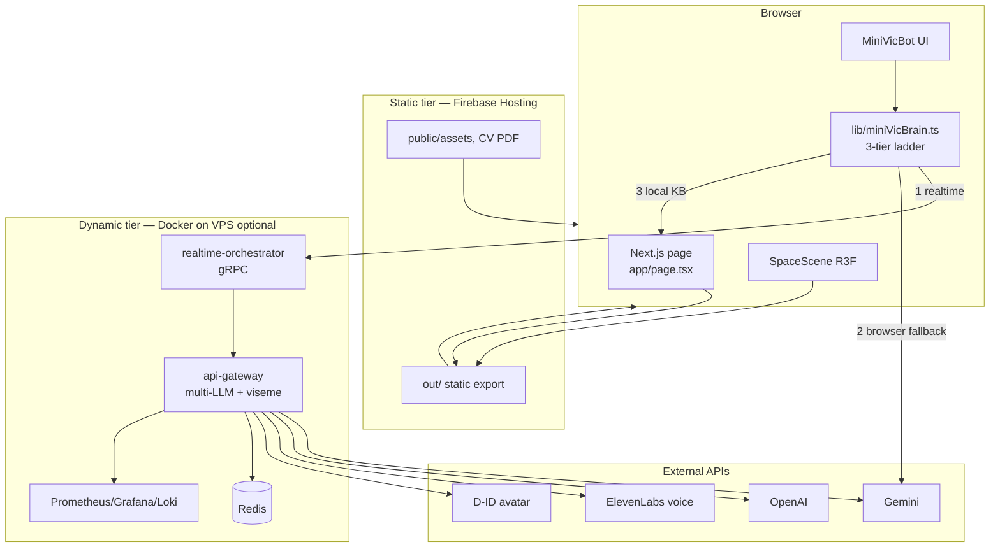
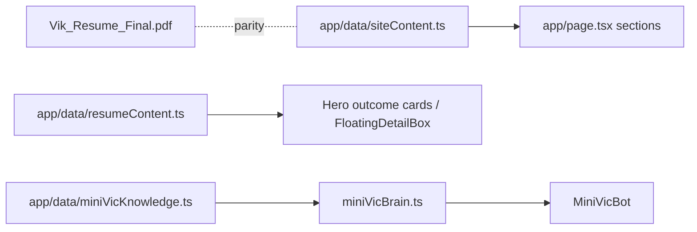
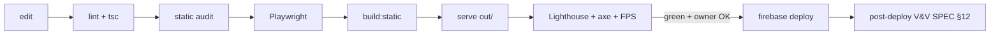

# Architecture

How the system is put together. Companion: `SYSTEM-DESIGN.md` (flows/topologies),
`TECH-STACK.md` (versions). Diagrams are Mermaid (render on GitHub).

## 1. Big picture

Two cooperating tiers. The **static site** is the product; the **dynamic backend** is an
optional enhancement for the live AI clone.



## 2. Frontend composition

Single-page app. `app/page.tsx` composes typed sections. Component-level DOM motion uses Framer
Motion; **scroll orchestration uses GSAP + ScrollTrigger** (`lib/gsap.ts` registration +
`components/site/ScrollRail.tsx`, FR-SCROLL). There is no legacy imperative `public/script.js`
layer — the GSAP timeline is React-managed via `gsap.context()` with `ctx.revert()` cleanup.

```
app/layout.tsx        fonts, <head> metadata, JSON-LD (Person + WebSite), MotionProvider
  └─ app/page.tsx     Preloader → Navigation → Hero(+Avatar) → Proof → About → Experience
                      → Signature FX → Project catalogue → Skills → MiniVic → Contact → Footer
```

Component families:
- **Chrome:** `Preloader`, `Navigation`, `CursorGlow`, footer.
- **Reveal/motion:** `Reveal` (scroll-in), `MotionProvider` (reduced-motion context),
  `ScrollRail` (the GSAP ScrollTrigger scrubbed/pinned timeline, FR-SCROLL).
- **Content:** `ProofBar` (count-up metrics), `ExperienceAccordion`, `ExpandableCard`,
  `ProjectsCarousel`, `GithubFeed`, `TelemetryPanel`, `ArchitectureMap`, `HiddenTerminal`,
  `FloatingDetailBox`.
- **Hero:** `HeroAvatar` (video/still crossfade).
- **3D / signature:** `components/fx/HudFrame.tsx` → `components/fx/TelemetryHud.tsx` — the
  recurring monochrome telemetry-HUD motif (custom GLSL + volumetric stage lighting, the NN-2
  signature; mounted ×2 — hero backdrop + `#work`); `app/components/SpaceScene.tsx` (instanced
  starfield + nebula shader + shooting stars + post-FX, demoted behind content). Colours via
  `lib/palette.ts`.
- **AI clone:** `components/MiniVicBot.tsx` (UI) + `lib/miniVicBrain.ts` (reasoning).

## 3. Data flow (content)



Content is **pure data**, decoupled from presentation. Parity (CV ⇄ site) is a tested
invariant (`overhaul_static_audit.mjs` → TC-FR-PARITY).

## 4. The MiniVic clone — 3-tier answer ladder

`lib/miniVicBrain.ts` resolves answers in order; first success wins:

1. **Realtime orchestrator / API routes** — live LLM stream (only when the dynamic backend or
   `npm run dev` is present). Handled by `MiniVicBot`.
2. **Browser Gemini** — direct `generateContent`, grounded in the knowledge base. Needs
   `NEXT_PUBLIC_GEMINI_API_KEY` (referrer-restricted). This is the path on static Firebase.
3. **Local knowledge base** — deterministic matching over `miniVicKnowledge.ts`. Always
   available; works fully offline.

Voice (ElevenLabs) + avatar lip-sync (D-ID viseme bridge) are tier-1 features; the static site
ships pre-rendered synced media as the durable default.

## 5. Dynamic backend (services/)

```
services/api-gateway/src/
  index.ts                 HTTP entry; CORS + rate-limit hardening
  providers/               gemini, openai, local-llama, mock (interface + index)
  lib/                     metrics, provider-error, ttft-benchmark
  realtime/                grpc-client.ts + realtime_orchestrator.proto
  viseme/smoother.ts       phoneme→viseme smoothing for D-ID lip-sync
services/realtime-orchestrator/   gRPC session orchestration
services/llm-engine/              model serving slot
```

`docker-compose.yml` wires: frontend, api-gateway, realtime-orchestrator, llm-engine, redis,
nginx-proxy, prometheus, grafana, loki, promtail. Proxy/observability configs in `config/`.

## 6. Build & deploy pipeline



Pipeline per SPEC §11. `.github/workflows/deploy.yml` now implements the full gate as parallel
jobs: **quality** (`tsc --noEmit` + `overhaul_static_audit.mjs`), **lint**, **test**
(chromium + webkit + firefox), **lighthouse** (`validate:phase02`), **axe** (`validate:phase06`),
then **build** (`needs: [quality, lint, test, lighthouse, axe]`) → **deploy** (`main` only).
(QA-CI-01 / QA-DR-03 RESOLVED — green-on-push confirmable once the owner pushes.) Deploy is
owner-gated and local-first.

## 7. Rendering & layering (z-order)

`SpaceScene` is a fixed full-viewport WebGL layer behind content; sections are transparent and
sit above it; the preloader and cursor are top-most. `mix-blend-mode: screen` on the scene
layer requires dark scene colours (see gotchas in `CLAUDE.md`).

## 8. Key invariants

- Content lives only in `app/data/*`; components never inline facts.
- Colours come only from `:root` tokens + `lib/palette.ts`.
- Every animated surface has a reduced-motion fallback.
- `app/api/*` is dynamic-only; the static site must work without it.
- Parity, tone, monochrome, asset-budget, and secret invariants are enforced by the audit.
