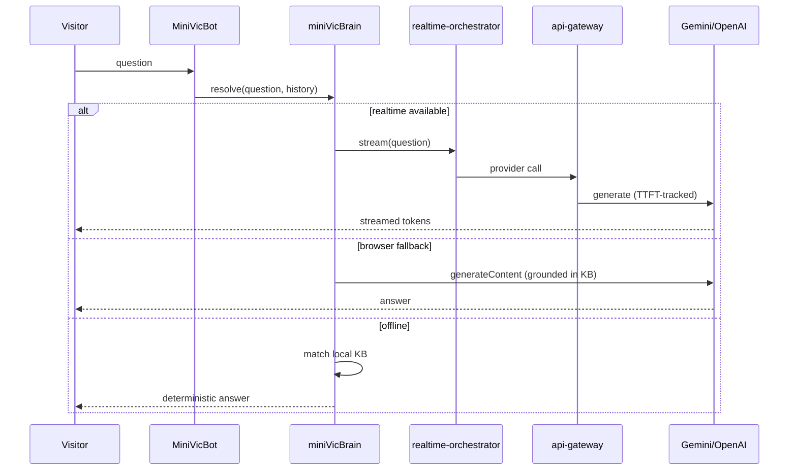
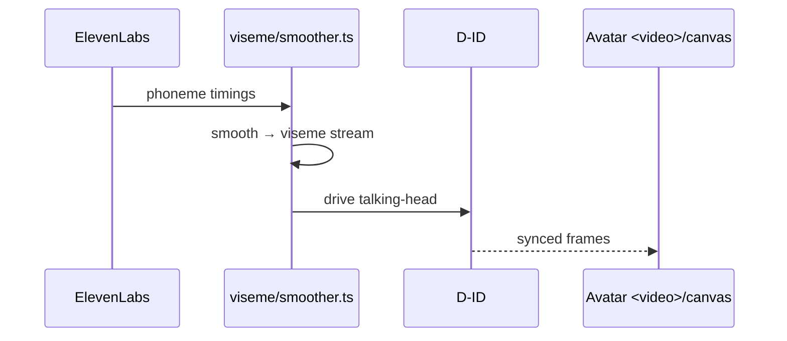

# System design

Deeper design: deployment topologies, runtime flows, state, performance, security, scaling.
Companion: `ARCHITECTURE.md`.

## 1. Deployment topologies

### A. Static (default / production today)
`build:static` → `out/` → Firebase Hosting (global CDN). No server. MiniVic uses tiers 2–3.
Pros: fast, cheap, durable, offline-after-visit. Cons: no live realtime clone, no server secrets.

### B. Dynamic (enhancement)
Docker Compose on a VPS (Hostinger). Traefik/nginx TLS-terminates; `api-gateway` fronts the
LLM providers; `realtime-orchestrator` streams sessions over gRPC/WebSocket; Redis holds
session state; Prometheus/Grafana/Loki observe. MiniVic uses tier 1 (live LLM + voice + D-ID).

### C. Hybrid (recommended target)
Static site for everything; the MiniVic "go live" affordance connects to the dynamic backend
behind a feature flag (`NEXT_PUBLIC_REALTIME_WS_URL`). Falls back to tiers 2–3 if absent.

## 2. Runtime flows

### 2.1 Chat (MiniVic)

### 2.2 Voice greeting (ElevenLabs)
Pre-generated from Vikram's **cloned** voice id at build/asset time → cached static MP3 →
played on user gesture (autoplay-policy safe). Live path: `api-gateway` → ElevenLabs stream.
The wrong-voice defect (D-1) comes from a plan-restricted live call falling back to a generic
voice; the fix is to pre-render with the correct voice id and verify the id in test (TC-FR-VOICE).

### 2.3 Avatar lip-sync (D-ID viseme bridge)

Static default: a pre-rendered MP4 already synced to the greeting audio (no live sync needed).

## 3. State management

- **Content state:** static, imported from `app/data/*` (no runtime store).
- **UI state:** local React state + Framer Motion; reduced-motion via `MotionProvider`.
- **Chat state:** in-memory turn history in `MiniVicBot` (bounded, see `MAX_HISTORY_TURNS`).
- **Session state (dynamic):** Redis in the backend; browser holds a session token only.
- No global client store is needed; resist adding one (YAGNI).

## 4. Performance strategy (budgets in SPEC §3.5)

- **Static-first** + CDN; aggressive caching; offline-after-visit (NN-2 durability).
- **Media:** AVIF/WebP with PNG fallback; lazy-load; the 6 MB `EMAIL.jpeg`/`TELEPHONE.jpeg` icons are removed (D-4 done, replaced by SVG/optimised);
  re-encode avatar MP4s. Asset budget enforced by the audit (≤500 KB/asset).
- **WebGL:** instanced stars, merged geometry, DPR cap, throttled CanvasTexture, no per-frame
  allocation, post-FX disabled on low-power/reduced-motion devices (already in SpaceScene).
- **JS:** code-split heavy scenes; defer non-critical; keep first-view ≤2.5 MB.
- **CLS:** reserve space for media/iframes; avoid layout-shifting reveals.

## 5. Security model

- **Secrets:** server-only; never in the client bundle. `NEXT_PUBLIC_*` keys (e.g. browser
  Gemini) MUST be HTTP-referrer-restricted to the production domain.
- **Fail loud:** required keys missing → explicit non-zero build/init crash naming the key, not silent degradation to an insecure path (SPEC NFR-SEC).
- **Backend hardening:** CORS allow-list, rate limiting (429 thresholds), HSTS, TLS via
  Traefik/Let's Encrypt (validated by `validate:phase15`).
- **Static export secret scan:** `overhaul_static_audit.mjs` (TC-NFR-SEC) + a build check that
  `out/` contains no secret patterns.
- **`.env.production` is radioactive** (SSH key, GitHub PAT, sudo password) — never read aloud,
  print, or commit.

## 6. Scaling

- **Static tier:** scales on the CDN for free; effectively unbounded read traffic.
- **Dynamic tier:** stateless `api-gateway` behind the proxy scales horizontally; Redis for
  shared session state; LLM cost/latency is the real constraint — TTFT is benchmarked
  (`ttft-benchmark.ts`, `validate:phase07`) and providers are swappable via the provider
  interface. Observability (Prometheus/Grafana/Loki) drives capacity decisions
  (`validate:phase18-20`).

## 7. Failure modes & resilience (see EDGE-CASES.md for the full matrix)

| Failure | Behaviour |
|---|---|
| Dynamic backend down | MiniVic degrades to browser-Gemini, then local KB |
| Gemini key absent/blocked | Local KB answers; UI states "offline mode" honestly |
| WebGL unsupported / low power | Post-FX off; static starfield fallback |
| ElevenLabs plan-restricted | Pre-rendered cloned-voice MP3 served; no generic substitute |
| Asset/CDN miss | PNG fallback; cached shell renders |
| Reduced-motion | All motion replaced by static states |
